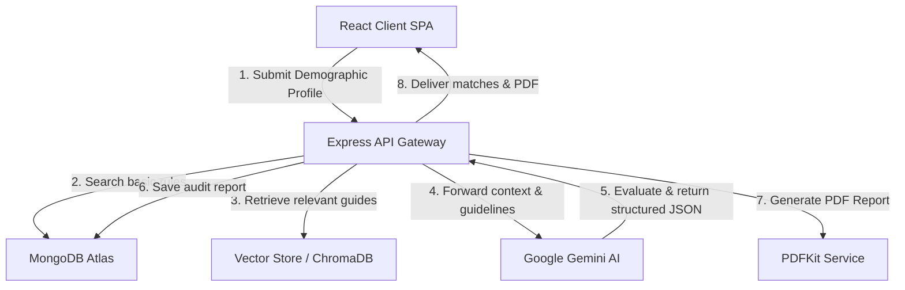

# Smart Scheme Assistant (SaaS Startup Platform)

> **"Find Government Benefits You're Eligible For in Seconds."**

---

## Project Overview
The **Smart Scheme Assistant** is an AI-powered automation platform that helps Indian citizens discover government welfare schemes they qualify for. By automating eligibility audits, synthesizing documents checklists, and providing interactive translations, it bridges the gap between complex government policies and the citizens who need them.

---

## Problem Statement
- **Lack of Awareness:** Many citizens are unaware of welfare schemes they are eligible for.
- **Confusing Portals:** Searching multiple department websites is time-consuming and confusing.
- **Complex Demands:** Document criteria and application steps are difficult to decipher.

The **Smart Scheme Assistant** resolves this by automating the discovery process using AI.

---

## Objectives
- Automate government welfare scheme discovery.
- Use AI to audit eligibility contextually.
- Generate customized document checklists automatically.
- Provide step-by-step application guidance.
- Deliver multilingual chatbot support (English, Hindi, Tamil) with speech features.

---

## System Architecture



---

## Technology Stack

### Frontend
- **Framework:** React.js (Vite scaffolded)
- **Styling:** Custom CSS (Modern Glassmorphism system, responsive Grid)
- **Icons:** Lucide React
- **Animations:** Canvas Confetti

### Backend
- **Framework:** Node.js, Express.js
- **Database:** MongoDB Atlas (Mongoose Object modeling)
- **Vector Search:** Google Gemini embeddings (`text-embedding-004`) + Cosine similarity (integrated ChromaDB adapter)
- **AI Integration:** Google Gemini API (`gemini-1.5-flash`)
- **PDF Generation:** PDFKit
- **Security:** JWT, bcryptjs, Helmet, Rate Limiter, CORS

---

## Folder Structure

```
├── client/                 # React Frontend (Vite)
│   ├── src/
│   │   ├── components/     # Navbar, Sidebar, VoiceInput
│   │   ├── context/        # Auth, Theme, Language/i18n Providers
│   │   ├── pages/          # Landing, Dashboard, Eligibility, Saved, Chat, Profile, Settings, Downloads, Admin
│   │   ├── styles/         # Global Custom CSS
│   │   ├── main.jsx        # Bootstrap
│   │   └── App.jsx         # Router Setup
│   └── index.html
├── server/                 # Node.js/Express Backend
│   ├── config/             # DB Connection Config
│   ├── database/           # Seeder script (30+ schemes)
│   ├── middleware/         # JWT Auth Verification
│   ├── models/             # Mongoose Schemas
│   ├── routes/             # REST API Routes
│   ├── services/           # Gemini, PDFKit, Vector Cosine Search
│   └── server.js           # Server Bootstrapper
├── docker/                 # Deployment Configurations
│   ├── client.Dockerfile
│   └── server.Dockerfile
└── docker-compose.yml      # Multi-container orchestrator
```

---

## Prompt Engineering Specifications
The AI checker utilizes Google Gemini API with advanced prompt engineering techniques:
- **Role Prompting:** "You are Smart Scheme Assistant. You are an Indian Government Welfare Expert. Never hallucinate."
- **Context Injection:** Inserts candidate schemes matching basic demographic rules directly into the context window.
- **Structured JSON Output:** Enforces strict response parsing matching the frontend components.
- **Parameters:** Capped at `Temperature 0.2` to ensure consistent and non-creative audits.

---

## Database Design (MongoDB Collections)
1. **Users:** Credentials, roles (user/admin), demographic parameters.
2. **Schemes:** Welfare program name, categories, state limits, benefits description, documents requirements list, official link.
3. **Bookmarks:** User reference, scheme reference.
4. **Reports:** Audit reports detailing matching schemes and AI generated checkpoints.
5. **SearchHistory:** Search criteria logs.
6. **Feedback:** Platform reviews and ratings.
7. **ChatHistory:** Message logs for chatbot context.

---

## API Documentation

### Public / Authentication
- `POST /api/auth/register` - Create account & generate JWT token.
- `POST /api/auth/login` - Validate credentials and login.
- `POST /api/feedback` - Submit platform reviews.

### Protected (Requires JWT Authorization header)
- `GET /api/profile` - Retrieve logged-in user credentials.
- `PUT /api/profile` - Update user demographic profile.
- `POST /api/eligibility` - Run AI eligibility audit & save report.
- `GET /api/schemes` - Query welfare schemes (Supports standard regex query `search` & Vector semantic `type=vector`).
- `POST /api/chat` - Chat with assistant (supports history & i18n instructions).
- `GET /api/chat/history` - Retrieve chat transcript logs.
- `GET /api/bookmarks` - List user saved schemes.
- `POST /api/bookmarks` - Add bookmark.
- `DELETE /api/bookmarks/:schemeId` - Delete bookmark.
- `GET /api/reports` - Retrieve generated reports list.
- `GET /api/reports/:reportId/pdf` - Streams compiled PDF report.

### Admin Panel (Requires Admin Role)
- `GET /api/admin/analytics` - Fetch platform usage, ratings, and simulated traffic metrics.
- `GET /api/admin/users` - Fetch user list accounts.
- `POST /api/admin/schemes` - Register new scheme.
- `PUT /api/admin/schemes/:id` - Edit scheme rules.
- `DELETE /api/admin/schemes/:id` - Delete scheme.

---

## Installation Guide

### Prerequisites
- Node.js (v18+)
- MongoDB (running locally on port 27017 or MongoDB Atlas URI)

### Local Configuration Setup
1. Create a `.env` file in the `/server` directory:
   ```env
   PORT=5000
   MONGODB_URI=mongodb://localhost:27017/smart-scheme-assistant
   JWT_SECRET=your_jwt_secret_key_here
   GEMINI_API_KEY=your_google_gemini_api_key_here
   NODE_ENV=development
   ```

2. Start the Backend Server:
   ```bash
   cd server
   npm install
   npm run seed  # Seeds 30+ default schemes
   npm start     # Runs on port 5000
   ```

3. Start the Frontend Dev Server:
   ```bash
   cd client
   npm install --legacy-peer-deps
   npm run dev   # Runs on port 5173
   ```

---

## Docker Deployment Guide
To build and run the entire multi-container stack (MongoDB, ChromaDB, Express Server, and React client served by Nginx):

```bash
# In the root workspace directory containing docker-compose.yml
docker-compose up --build
```
- Client interface exposes on: `http://localhost:8080`
- Server API exposes on: `http://localhost:5000`

---

## License
Distributed under the MIT License.
